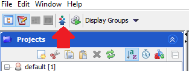

# FLIM_zarr2ome_tif

This repository hosts Python scripts and notebooks to convert FLIM data from `.zarr` (generated with [napari-flim-phasor-plotter](https://github.com/zoccoler/napari-flim-phasor-plotter) plugin) to `.ome.tif` format. It also shows an example of how to upload the `.ome.tif` files to an [OMERO](https://www.openmicroscopy.org/omero/) server.

The code here replaces the time axis by the microtime/histogram/photon counts axis so that the raw FLIM data gets properly displayed in OMERO. If the data is a time-lapse, it generates a separate `.ome.tif` file for each timepoint.

## Usage

Clone or download this repository locally.

Download and install [miniforge](https://github.com/conda-forge/miniforge?tab=readme-ov-file#miniforge). Then, from a terminal, create a conda environemnt with:

mamba env create -f https://github.com/zoccoler/FLIM_zarr2ome_tif/raw/main/env.yml

Activate the environment with:

mamba activate zarr2ometif

From the activated environment, open Jupyter Lab with:

`jupyter-lab`

Open the `save_as_ome_tif.ipynb` notebook, replace the input path to your local `.zarr` file, update metadata variables if necessary (like pixel sizes), and run the cells.
A new folder called `OME_TIF` will be created in the same directory as the `.zarr` file, containing the `.ome.tif` files.

### Upload to OMERO

To upload the `.ome.tif` files to an OMERO server, download and install the [OMERO Insight application](https://www.openmicroscopy.org/omero/downloads/). Open the application, connect to the server, and click on the Importer button.

